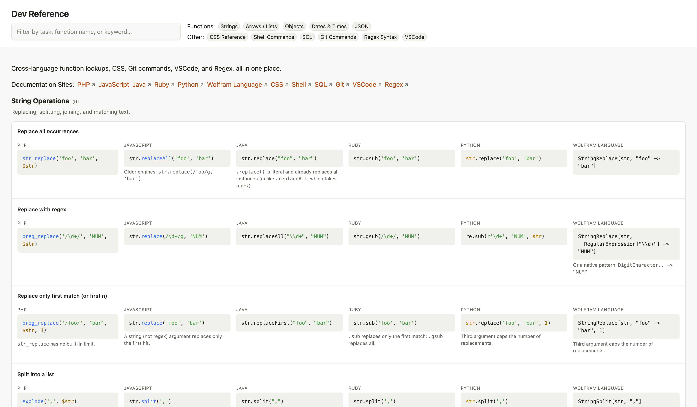

# Dev Reference

This reference guide is created with help from Claude. You may use it by opening it in your browser directly, or if you have Node.js, you can run `npx http-server` and open it then. I've also added it to Github pages.

Syntax highligher is from [highlightjs.org](https://highlightjs.org/).

